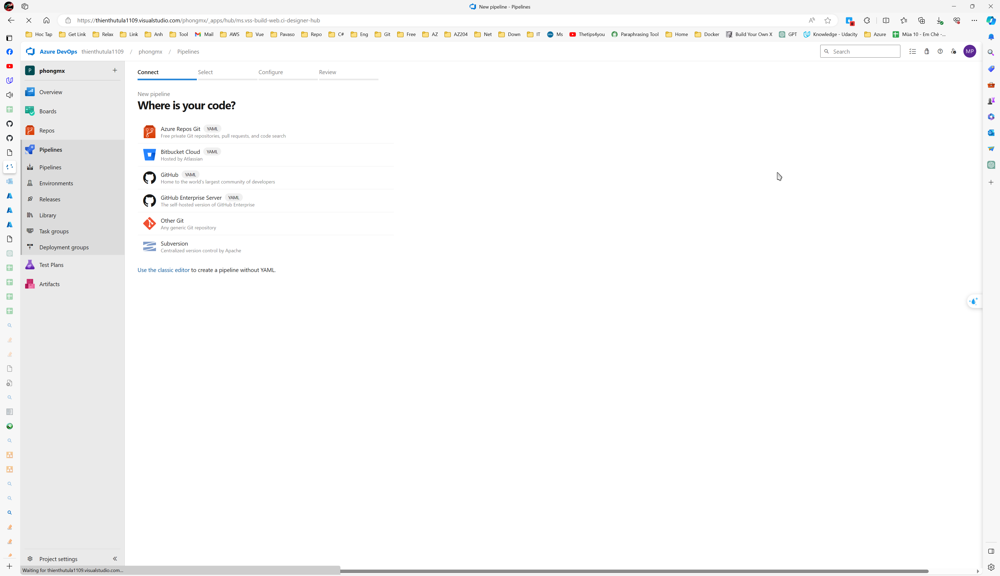

###  Overview

The aim of this project is to build a fresh Github repository from the ground up and establish the necessary foundation for implementing both Continuous Integration and Continuous Delivery.

###  Project Plan

- [Trello Board](https://trello.com/b/DvAKdGrF/azuredevops)
- [Excel plan](https://docs.google.com/spreadsheets/d/1QqHZZfnMLeNFm7g1mAVXYscb9S9T_2ZXPnUDDwTL4r8/edit?usp=sharing)

###  Architect
 
 

###  Run Github Actions

[](https://github.com/phongmx2021/Project2/actions/workflows/pythonapp.yml)


### Project Locally

- Cloned Project into Azure Cloud Shell


- Create and active virtual env:

  ```bash
    python3 -m venv ~/.myvenv
    source ~/.myvenv/bin/activate
  ```

- Install dependencies and make test, lint with Make file:


- Run application
```bash
    make install
    python -m flask run
```
- Run test make prediction

```bash
    ./make_prediction
```


### Azure Web App

- Run script to create web app and first deployed to web app

```bash
    ./commands.sh
```


- Web App was created 


- Load test with web app by Locust


### Azure DevOps

Go to Azure Devops > Create new project & and follow Image below to add connection


- Add new Pipelines




- Deploy project to Azure Pipelines


- Running on Azure App Service


- Web App with Azure Pipelines in Deployment Center

- Web App Deployed Logs

- Output of streamed log 


- Check result predict


### how to improve the project in the future

Implement Terraform & packer to make the step build infra faster

### Video demonstration
https://youtu.be/vvBCiKZxu3M